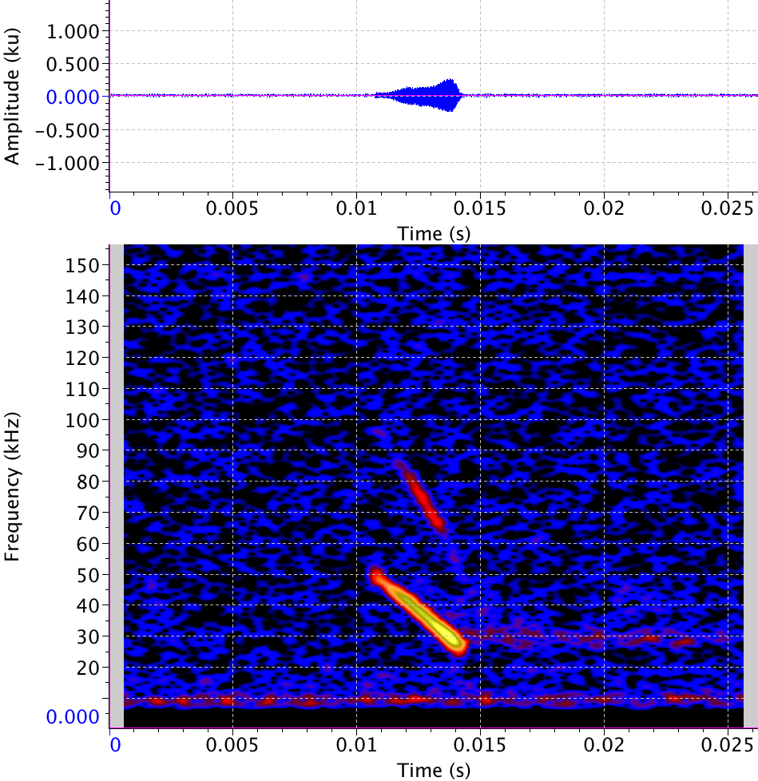

# Notes on Batscope Taxonomy

how to read those values? taken from [Barbastella barbastellus/detail.xml](Barbastella barbastellus/detail.xml)

```txt
callCount =        "151"
filename =         "type1"

durLow95 =         "10.763"
durMean =          "11.875"
durUp95 =          "12.986"

durLow95Fil =      "2.854"
durMeanFil =       "2.981"
durUp95Fil =       "3.108"


highFreqLow95 =    "80.288"
highFreqMean =     "85.922"
highFreqUp95 =     "91.556"

highFreqLow95Fil = "43.241"
highFreqMeanFil =  "43.840"
highFreqUp95Fil =  "44.439"


lowFreqLow95 =     "14.714"
lowFreqMean =      "16.255"
lowFreqUp95 =      "17.796"

lowFreqLow95Fil =  "29.988"
lowFreqMeanFil =   "30.393"
lowFreqUp95Fil =   "30.799"


peakFreqLow95 =    "37.602"
peakFreqMean =     "38.390"
peakFreqUp95 =     "39.179"
```


